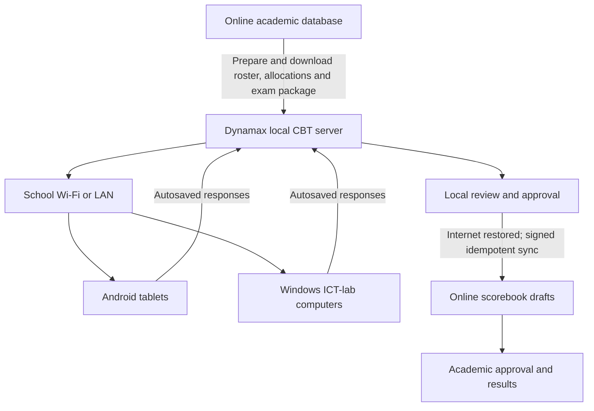

# Academic Management Phase

Status: approved baseline; implementation in progress.

Implementation status (2026-08-16): Milestones 1 and 2 are in progress, the
secure parent-access slice of Milestone 3 is operational, Milestone 4 is
operational, and the Milestone 5 assessment, scorebook and spreadsheet-import
slice is operational on the web companion and desktop source. The Milestone 6
local CBT foundation and Milestone 7 examination-authoring/document-delivery
slice are also operational in the desktop source. The School
edition now has an effective-dated academic-policy schema, immutable
policy revisions, separate draft and active states, organisation-to-branch
inheritance, activation validation and administrator controls for result
visibility, financial clearance, positions, assessment components, grading
and promotion. The first AM-002/AM-003 vertical slice is also operational on
web and desktop: branch-isolated sessions, terms, Primary classes, distinct
Junior/Senior Secondary classes, arms, subjects, Senior departments and their
core subjects, subject offerings, teacher allocations and term-specific
student class/arm/department/subject memberships share one protected online
model. Junior students automatically receive every subject offered to their
class or arm; Senior students receive common compulsory offerings, their
department core subjects and any selected additional subjects. It
includes stable identifiers, effective-period scope, server-side role and
section enforcement, optimistic concurrency, audit history, archive guards,
Teacher read-only registers, and compatibility updates for existing class and
student records. Student allocation now supports atomic batches of up to 100,
class and arm capacity enforcement, controlled class/arm/department/subject
changes, withdrawal and reinstatement, and immutable before/after movement
history on web and desktop. Administrators can also create up to 50 classes,
reusable arm definitions or reusable subject definitions in one online batch,
then apply selected catalogue arms or subjects across selected classes in an
atomic batch. Unused classes, arms and subjects can be permanently deleted,
but active or historical references block deletion. The parent dashboard now
evaluates published academic-result records against the active inherited
visibility and financial-clearance policy on the server, fails closed when the
policy is missing or incomplete, limits records to the linked child and
selected branch/section, withholds score details when access is blocked,
rechecks access before printing and audits view, denial, exemption and print
decisions without copying ledger details. The web companion and desktop now
share configurable school days and periods, including a reusable default week
with validated day-specific time overrides, immutable timetable-version
snapshots, Draft/Approved/Published/Withdrawn release states, exact
classroom/subject-teacher lessons, and server-side classroom, teacher and room
conflict detection. Allocated form, assistant and subject teachers can mark
Daily, Period or Subject attendance using Present, Absent, Late, Excused and
Left Early states; changes to saved teacher records become approval requests,
while authorized academic administrators decide them with an audit reason.
Parents see only their linked child's published class schedule and scoped
attendance summary. Timetable managers can now configure exact unavailable
lesson slots and optional daily/weekly period limits per teacher; those rules
are enforced when lessons are saved and again before approval or publication.
An existing timetable version can be copied safely into a revalidated Draft
using resumable database batches, and web and desktop provide print-ready class
and teacher schedules using the version's saved day-specific times. Managers
can also preview and copy one classroom between selected arms, classes or terms
without duplicating matching lessons. Dated teacher substitutions preserve the
published timetable, validate subject qualification, conflicts, availability
and workload, and authorize the substitute to mark the exact Period register.
Attendance changes are recoverable as device-local drafts until online
synchronization succeeds on both web and desktop. Confirmed absences create
idempotent parent in-app/push notifications, and per-student term summaries can
be reviewed and printed by classroom and register type. Score sheets now
capture an immutable active assessment-scheme revision, restrict entry to the
allocated subject teacher or authorized academic staff, validate configured
component maxima and special Missing/Absent/Exempt/Incomplete states, and
calculate weighted totals, grade points, classifications and remarks. Their
audited lifecycle is Draft, Submitted, Approved and Locked, with authorized
reasoned reopening. Pre-filled CSV templates and CSV/XLSX imports provide an
online validation preview, all-or-nothing or valid-row-only commit policy,
stable idempotency and rollback while the affected score sheet remains an
unpublished Draft. Source restrictions are enforced per component: manual-only
components remain locked during imports, while spreadsheet/CBT-only components
remain visible but locked during manual entry. Partial imports merge their
supplied components with existing scores instead of clearing scores captured
through another approved source. The desktop source uses the same protected
online actions and reads XLSX files without adding a runtime package.
The desktop source now includes a workspace-scoped SQLite CBT store in WAL mode,
rotating local backups, transactional examination packages and rosters,
encrypted student password verifiers and face templates, short-lived hashed
attempt tokens, authoritative server
timing, idempotent answer checkpoints and audited one-device-per-attempt
enforcement with reasoned invigilator transfer. Its local LAN server exposes a
single responsive examination client for Android tablets and Windows lab
computers, with device-local IndexedDB recovery, reconnection replay, heartbeat,
focus/connectivity events, final submission and no service-worker candidate
caching. The authorized desktop console starts and monitors the server, shows
the school-network address and QR code, opens readiness sessions from current
academic allocations, securely imports the selected students' login identities,
manages examination state,
and performs controlled device transfers. Examination officers can now create
native single-answer, multiple-answer, true/false, short and extended questions,
attach validated JPEG/PNG question media, or create Document and Mapped Document
examinations from validated JPEG, PNG or PDF papers. Candidate sessions receive
only safe question metadata; answer keys and original PDFs stay server-side.
PDF pages are rendered to optimized authenticated images and progressively
loaded inside the same responsive Android/Windows examination screen, with
mapped source-page and region navigation. Active PDF content, damaged files,
oversized files and unsupported signatures are rejected. Unused trial
examinations can be deleted, while attempt history blocks destructive deletion.
The packaged client assets are in
the desktop build definition, but the desktop application will not be compiled
until the remaining milestones are complete.
Result production and publication, finance-officer clearance administration,
promotion intake, transcripts and parent progress remain pending work. CBT
marking, external adapters and online score synchronization remain Milestone 8;
OCR-assisted question suggestions remain a separate review-gated authoring
slice and are not yet operational;
configuring a policy, academic structure or score sheet does not itself publish
a result.

This document is the authoritative product and engineering specification for
the Dynamax Academic Management phase. It covers the School edition of the web
companion, Dynamax Desktop, the built-in CBT system, Android tablet clients and
Windows ICT-lab clients. Requirements must not be removed, weakened or treated
as complete without updating this document in the same change.

## 1. Scope and product boundaries

The academic modules are School-edition features. Church and Other
Organisation workspaces must not display school academic navigation or accept
academic API operations. Shared authentication, subscription enforcement,
branch isolation, audit logging, backup, notifications and deployment identity
remain common platform services.

The phase covers:

- academic sessions, terms, school sections, classes, arms and subjects;
- teacher, student and subject allocations;
- class management, timetables and student attendance;
- configurable assessment, grading and promotion policies;
- score recording, spreadsheet import and CBT synchronization;
- a built-in local/offline CBT system;
- Android tablet and Windows ICT-lab examination clients;
- term results, cumulative results, parent progress and transcripts; and
- financial-clearance controls for parent result access.

## 2. Non-negotiable design principles

1. Academic and financial policies are configuration, not hardcoded business
   rules.
2. Authorization and result eligibility are enforced on the server. Hiding a
   button in the browser is never an access-control mechanism.
3. Every operational record carries workspace, branch, school-section,
   academic-session and term scope where applicable.
4. Historical results retain the policy, allocation and grade configuration
   used when they were calculated. A later settings change must not rewrite a
   published result.
5. Teachers can act only on allocated classes, arms, subjects and periods.
6. High-risk changes use draft, review, approval and lock states with an audit
   trail.
7. Imports and synchronizations are idempotent and safe to retry.
8. The local CBT server is authoritative during an offline examination;
   student devices hold only recoverable, temporary attempt data.
9. The same CBT examination works on Android tablets and Windows computers.
10. Accessibility, low-powered devices, unstable local Wi-Fi and recoverable
    device failure are normal operating conditions, not exceptional cases.
11. Existing academic data must be migrated or preserved; releases must not
    silently discard or reinterpret it.
12. Personally identifiable information, answers and results are minimized,
    encrypted where appropriate and excluded from public caches.

## 3. Requirements register

| ID | Requirement | Required outcome |
| --- | --- | --- |
| AM-001 | Parent result access | A parent can view or print only an eligible, published result permitted by the configured result-visibility and financial-clearance policies. |
| AM-002 | Academic allocations | Teachers are allocated classes, arms and subjects; students are allocated arms and registered subjects. |
| AM-003 | Class management | Sessions, terms, sections, levels, arms, subjects, capacities, transfers and historical class memberships are managed completely. |
| AM-004 | Timetables | Administrators can build conflict-checked class, teacher and room timetables. |
| AM-005 | Student attendance | Authorized teachers can mark, correct, review and report daily or period attendance. |
| AM-006 | Promotions | Configurable criteria produce reviewable promotion decisions and controlled next-session allocations. |
| AM-007 | Grading | Effective-dated, scoped grading and assessment schemes determine totals, grades, points and remarks. |
| AM-008 | Transcripts | Authorized staff can issue verifiable academic-history transcripts with approval and reissue history. |
| AM-009 | Score recording | Allocated teachers can record, submit and correct scores through an auditable scorebook. |
| AM-010 | Score importing | CSV/XLSX score imports provide templates, preview, validation, errors, idempotency and rollback before publication. |
| AM-011 | Parent progress | Parents can see approved, policy-permitted progress, results, attendance and trends for linked children only. |
| AM-012 | CBT | Dynamax includes a local/offline CBT and can also accept scores through controlled external-CBT adapters. |
| AM-013 | Cumulative results | End-of-session results combine configured terms and feed promotion and transcript workflows. |

## 4. Configurable policy engine

### 4.1 Scope and inheritance

Academic policies follow this precedence:

`Organisation -> Branch -> School section -> Class -> Subject`

A lower scope stores only an intentional override. Resetting the override
restores inheritance from the next applicable scope. Each policy version has an
effective session and term, creator, approval status and audit history.

The settings interface must show:

- the effective value;
- where it was inherited from;
- whether the current value is an override;
- the session and term in which it becomes effective; and
- the impact of changing it before saving.

Published results store a policy snapshot or immutable policy-version
reference.

### 4.2 Result visibility and financial clearance

Result access is controlled by selectable policies. Supported financial modes
must include:

- no financial restriction;
- block when any applicable balance remains;
- require a configurable percentage of applicable fees to be paid;
- allow up to a configurable maximum outstanding amount;
- evaluate only selected invoice or fee categories;
- recognize configured scholarships, payment plans and waivers; and
- require an explicit manual finance clearance.

Policies may vary by branch, section, class, session and term. An authorized
finance officer may grant an exemption with a reason, expiry, approving user
and audit record. Financial eligibility is calculated server-side for the
requested student and result period.

Result-visibility choices must include:

- current published term only;
- current session's published terms;
- all published term results; and
- published results plus approved transcripts.

The original business preference is current-term-only access with a fee gate,
but an administrator must explicitly select and approve the active policy. A
result cannot be published to parents while the required policy configuration
is incomplete.

A blocked parent receives a clear message without exposing internal ledger
details. Result view, print, failed eligibility and exemption use are audited.
Direct URLs, print routes and API calls apply the same checks.

### 4.3 Position policy

Position options must include:

- do not calculate positions;
- calculate internally but hide positions from parents;
- display exact overall class position;
- display subject positions only;
- display percentile or performance band rather than an exact rank; and
- display the number of assessed students without displaying rank.

The policy also defines treatment of tied scores, excluded students,
incomplete results and minimum assessed-subject requirements.

### 4.4 Assessment and grading policies

Administrators create reusable schemes instead of relying on fixed CA and exam
weights. An assessment component has:

- a configurable name and code;
- maximum raw score;
- percentage weight;
- required or optional status;
- allowed source: manual, spreadsheet import, built-in CBT or external CBT;
- applicable session, term and policy scope; and
- display and ordering rules.

Examples include CA1, CA2, assignment, project, practical, oral and
examination. Applicable weights must total 100 percent before a scheme can be
approved.

Grade bands define minimum and maximum totals, letter grade, grade point,
remark, colour/display metadata and pass/fail classification. Policies may be
different by section, class or subject. Overlapping or incomplete bands are
rejected.

### 4.5 Promotion policy

Promotion criteria are similarly configurable and may include:

- minimum overall average;
- required passes in selected core subjects;
- maximum failed subjects;
- minimum student-attendance percentage;
- required completion of all configured terms;
- special rules for graduating classes; and
- a manual-review band for borderline cases.

An authorized override records the original recommendation, final decision,
reason and approving officer.

## 5. Academic foundation and class management

The foundation module manages:

- academic sessions and terms, including one controlled current session and
  current term;
- school sections and class levels, with Secondary divided into Junior
  Secondary and Senior Secondary;
- class arms, capacities, rooms and form teachers;
- a reusable, branch-scoped arm catalogue: arm definitions are
  created once and may be applied to many classes without coupling the
  catalogue entry to any single class or school section;
- subjects, subject groups, subject codes and compulsory/elective status;
- configurable Senior Secondary departments such as Sciences, Arts and Social
  Sciences, each with a reusable department-wide core-subject set;
- subject availability by section, class and term;
- many-to-many teacher allocation: one teacher can hold multiple subject
  assignments across different classes and arms in the same term, with one
  auditable allocation record per class, arm and subject combination;
- independent teacher responsibilities: a Form Teacher or Assistant Teacher is
  assigned to a specific class arm without an artificial subject, and the same
  staff member may concurrently hold Subject Teacher assignments in other
  classes and arms;
- student enrollment in a session, class and arm;
- automatic assignment of every offered subject to Junior Secondary students,
  who do not select electives;
- assignment of Senior Secondary students to a department, automatically
  adding that department's core subjects and common compulsory offerings while
  permitting additional subject selection;
- bulk allocation, promotion intake, transfer and withdrawal;
- movement between arms without destroying earlier membership; and
- class, subject, teacher and student allocation history.

Stable identifiers, rather than display names, link all academic records.
Renaming a class or subject must not orphan scores or results.

Bulk class setup accepts a maximum of 50 class definitions per submission.
Bulk reusable-arm setup accepts a maximum of 50 catalogue entries, and arm
application accepts at most 200 class-arm combinations. Each operation is
atomic, skips exact retries, refuses to overwrite a conflicting existing
record and reports success only after the online commit succeeds. Applying a
catalogue arm creates an independent class-specific arm whose capacity and room
may subsequently be adjusted without changing the reusable definition.
Catalogue definitions are displayed separately from applied class arms, with
an applied-class count and a direct route to the assignment controls. Text
batch formats require their documented `|` separators and reject malformed
lines instead of silently creating a combined name and generated code.

Subjects are reusable within their selected school section. Bulk subject setup
accepts a maximum of 50 catalogue entries, and subject application accepts at
most 200 term-specific class-subject combinations. Subject records are reused
by class offerings, Senior departments, teacher allocations and student
curricula rather than copied for every use. Junior Secondary offerings are
made compulsory by the server.

A subject catalogue record stores its name, stable code and lifecycle status;
it is not globally labelled Core or non-Core. Senior Secondary core status is
owned by each department's core-subject selection, so the same subject may be
core in one department without being core in another. Class-offering
compulsory status remains a separate term-specific setting.

Archive retains a record and its identity. Permanent deletion is separately
available only for classes, reusable arm definitions, class arms, subjects and
Senior departments that have no references in
current or historical academic records. The server checks class sequences,
arms, offerings, teacher allocations, student memberships and immutable
movement history before deleting, and every accepted deletion is audited.

Senior department core subjects are not copied into a particular class
definition. A department is a branch-scoped Senior Secondary curriculum entity
that can be reused across SS classes. Before a student is allocated, each core
subject must be available as an active subject offering for the selected class
or arm. Junior subject membership is derived from the active offerings and
cannot be reduced by an elective choice in either the web or desktop client.

The existing-student migration CSV may seed a missing master student profile
from StudentRef, StudentName, class and arm. Seeded profiles are written only to
the selected branch and school section, are marked `Needs completion`, and can
be completed in the Students workspace. A reference already present in another
scope is rejected instead of duplicated. Senior department, Trade and Optional
codes may be omitted during migration; those memberships remain visibly
`Pending Department Selection` until the authorised in-app workflow completes
their curriculum.

Each student has at most one current membership for a branch, section, session
and term. A new term creates a new membership rather than overwriting an older
period. Within a term, class, arm, department and subject changes use a
controlled movement workflow; ordinary record editing cannot bypass it. Every
applied movement stores immutable before and after placement/subject snapshots,
effective date, reason and recording officer. Withdrawal closes the current
membership without deleting its placement, while reinstatement is separately
authorized and recorded.

Single and bulk allocations enforce configured class and arm capacities on the
server. Zero capacity means no configured limit. Bulk allocation is atomic:
all new memberships, student compatibility updates and movement records pass
validation together or none are saved. An exact retry skips already matching
memberships, while a conflicting membership must use the transfer workflow.

## 6. Roles and permissions

Initial role capabilities are configurable but must preserve these boundaries:

- **Academic Administrator:** configures academic structures and policies.
- **Principal/Head Teacher:** reviews and approves policies, results and final
  promotion decisions when delegated.
- **Form Teacher:** works with an assigned class, attendance, comments and
  class-level review. An Assistant Teacher may share the class responsibility.
- **Subject Teacher:** marks attendance and records scores only for allocated
  subject offerings.
- Class responsibility does not itself grant subject-score access. A Form
  Teacher or Assistant Teacher who also teaches subjects receives separate
  Subject Teacher allocations for those other classes, arms and offerings.
- **Examination Officer:** prepares assessment schemes, imports, CBT sessions,
  result calculations and examination review.
- **Finance Officer:** manages financial-clearance rules and exemptions without
  receiving score-edit permissions.
- **Transcript Officer:** prepares transcripts; an approving role authorizes
  issue.
- **Parent:** reads only eligible, published records belonging to linked
  children.

An assigned branch remains mandatory for branch-scoped staff. Organisation-wide
administrators may select an allowed branch, but every write is still stamped
with the resolved branch and section. Permission changes are audited.

## 7. Timetable builder

The timetable module must support:

- configurable school days, periods, breaks and assemblies;
- class, teacher and room timetables;
- single, double and practical periods;
- teacher availability and maximum-load constraints;
- room, teacher and class conflict detection;
- copy between arms, classes or terms with a validation preview;
- controlled substitutions and timetable versions;
- printable class and teacher schedules;
- parent/student read-only schedules; and
- links from scheduled lessons to period attendance and teacher scorebooks.

Draft timetables do not become operational until approved and published.

## 8. Student attendance

Student attendance is separate from existing staff time-and-attendance. It
supports:

- daily class attendance;
- optional period or subject attendance;
- Present, Absent, Late, Excused and Left Early statuses;
- bulk marking with individual exceptions;
- marking by an allocated form or subject teacher;
- offline-safe draft capture where supported;
- late correction through an approval workflow;
- absence notifications under the notification policy;
- class registers and term summaries;
- parent dashboard attendance summaries; and
- promotion-policy attendance percentages.

The system records who marked or corrected attendance, when it happened and
the reason for a late change.

## 9. Scorebook, grading and imports

### 9.1 Score lifecycle

Scores move through controlled states:

`Draft -> Submitted -> Reviewed/Approved -> Published/Locked`

Reopening an approved or published score requires specific permission, a
reason and an audit record. Recalculation identifies every affected result.

The scorebook provides:

- spreadsheet-style entry;
- allocated class, arm, subject and component filtering;
- maximum-score and numeric validation;
- Missing, Absent, Exempt and Incomplete states;
- automatic weighted totals, grades, points and remarks;
- save-as-draft and bulk submission;
- teacher, reviewer and approval status;
- class and subject performance analysis; and
- visible synchronization/source metadata for CBT or imports.

### 9.2 Spreadsheet imports

CSV and XLSX imports provide:

- downloadable templates generated for the selected allocation and component;
- stable admission-number and subject identifiers;
- a preview before any write;
- duplicate, unknown-student, unknown-subject and out-of-range detection;
- row-level and batch-level validation summaries;
- downloadable error reports;
- an administrator-selectable all-or-nothing or valid-rows-only policy;
- an idempotency key and immutable import record; and
- rollback while imported scores remain unpublished.

Templates include only assessment components whose configured source accepts
spreadsheet entry. A partial component import preserves the student's existing
manual or CBT component scores and recalculates from the merged draft.

Imports never create a class, student, subject or allocation implicitly.

## 10. Built-in local/offline CBT

### 10.1 Deployment model

Dynamax Desktop on a designated school Windows computer acts as the local CBT
server and administrator console. Android tablets and Windows ICT-lab computers
connect through the school's local Wi-Fi or LAN. Internet connectivity is not
required during an examination.

The same responsive examination client supports touchscreens, physical
keyboards and mice. An optional installable PWA may improve launch convenience,
but the primary workflow must remain available in a supported browser.

### 10.2 Local data store

SQLite is the initial local server database. It stores:

- examination definitions, versions and schedules;
- local examination assets;
- candidate roster and authorized allocations;
- encrypted student login identities and one-use live-face challenges;
- questions, options, answer keys and marks;
- candidate attempts and responses;
- autosave checkpoints and connection history;
- objective and manually marked scores;
- approval and synchronization batches; and
- administrator and invigilator audit events.

The database uses transactions and an appropriate journaling mode for
concurrent examination writes. Backups are encrypted or otherwise protected by
the desktop data-protection design. Passwords and reusable online credentials
are never stored in plaintext.

Student devices keep only a short-lived, scoped recovery buffer. The local
server remains the authoritative examination record.

### 10.3 Examination authoring and uploaded papers

The built-in CBT supports native question authoring and JPEG, PNG and PDF
uploads.

Target document modes are:

1. **Document examination:** display the uploaded paper while students answer
   in a separate numbered response panel.
2. **Mapped document examination:** associate question numbers, types, marks,
   options, answer keys and source pages with the uploaded paper so mapped
   objective responses can be marked automatically.
3. **OCR-assisted import:** propose questions from a scan or PDF. An authorized
   user must review and correct every extracted question before publication.

OCR is never treated as perfectly reliable. Formulae, diagrams, tables, poor
scans and handwriting require human review.

Implementation status: native question authoring, per-question JPEG/PNG media,
Document examination and Mapped document examination are operational in the
desktop source. OCR-assisted import remains pending and will not bypass the
mandatory authorized review described above.

Native question types include single-answer objective, multiple-response,
true/false, short answer and extended written answer. Questions may include
images, diagrams and approved supporting files. Subjective answers require
manual marking unless a separately approved marking feature is introduced.

Uploaded files are signature-checked, type-checked and size-limited. Active
content and unsafe formats are rejected. PDFs are rendered inside the CBT
viewer rather than opened in an external Android application. Page images and
other assets are optimized and progressively loaded for lower-powered tablets.

### 10.4 Offline examination workflow

1. An examination officer prepares an approved roster, allocations, policy and
   examination package while online.
2. The package is downloaded to the local server and verified before the
   examination begins.
3. The local server starts an examination session and displays a local address
   and QR joining code.
4. A candidate enters the examination code and admission number, then signs in
   with their personal student password or a live check against their enrolled
   face. The admission number is always matched to exactly one authorized
   attempt before either proof is accepted. Password login uses a short-lived,
   single-use challenge and sends only a derived proof; the typed password does
   not leave the candidate device.
5. The client loads the examination from the local server and continuously
   saves answers locally.
6. A brief Wi-Fi interruption buffers recent answers on the device and resumes
   synchronization after reconnection.
7. The local server controls official time, pause, resume and submission.
8. Objective answers are marked locally; authorized teachers mark subjective
   answers.
9. An officer reviews and approves the completed examination batch.
10. When internet returns, the local server securely uploads the approved batch
    into the matching online scorebook component as draft scores.
11. The online server revalidates workspace, branch, allocation, candidate,
    component, maximum score, duplicate and policy information.
12. Academic approval, not synchronization alone, makes the scores final.

### 10.5 Android and Windows client requirements

The examination client must provide:

- responsive layouts for tablets, laptops and desktop monitors;
- large touch-friendly controls and keyboard navigation;
- clear current-question, answered, flagged and remaining-time states;
- autosave after every meaningful response change;
- a visible connection and last-saved indicator;
- low-memory and low-bandwidth operation;
- progressive loading of large document pages;
- support for supported Android Chrome-family browsers and supported Windows
  browsers;
- a clear password fallback when the browser or local origin cannot provide a
  secure camera context for face verification;
- client-side recovery buffering using an appropriate browser store such as
  IndexedDB;
- no public or service-worker caching of another candidate's data; and
- accessible contrast, focus order, labels and error messages.

A supported-device matrix will be recorded after the school inventories the
Android versions, browsers, screen sizes and expected concurrent candidate
count.

### 10.6 Device failure and ICT-lab fallback

Only one active device is permitted per candidate attempt. When a tablet
develops a problem:

1. an invigilator pauses or locks the attempt;
2. the student moves to a Windows ICT-lab computer;
3. the invigilator authorizes a device transfer;
4. the student resumes from the last server-confirmed response; and
5. the original device is prevented from continuing.

The transfer records the old device/session, new device/session, invigilator,
reason, time and response checkpoint. The same controlled transfer works in the
opposite direction.

### 10.7 Network and operational resilience

The recommended examination network uses a dedicated router or access point
with the CBT server on a stable local address. Joining is available through a
QR code, friendly local name where supported and IP-address fallback.

Operational safeguards include:

- a pre-examination network and device readiness check;
- server disk-space, clock, database and backup checks;
- continuous candidate connection/heartbeat status;
- server-confirmed final submission;
- recovery after a local server or desktop-app restart;
- encrypted local backups and documented restore drills;
- an uninterruptible power supply for the server and network equipment where
  practicable;
- load testing at and above the expected concurrent-candidate count; and
- a printed/exportable emergency register and documented incident process.

### 10.8 CBT security and realistic limitations

The built-in controls include:

- admission-number login using a separately scoped student password or enrolled
  face; parent login codes are never reused for CBT;
- PBKDF2 password verifiers and face descriptors encrypted at rest in the
  Windows-account-protected local identity vault;
- one-use password challenge-response proofs so the personal password is never
  posted to the local server;
- a one-use, short-lived random blink or head-movement challenge before each
  face login, with camera frames processed only on the candidate device and the
  temporary descriptor hybrid-encrypted to the current local server key;
- one active attempt per candidate;
- server-controlled schedules and timing;
- question and option randomization;
- attempt pause, lock, resume and transfer controls;
- focus-loss and tab-switch event recording;
- role-limited invigilator and examination-officer actions;
- signed examination packages and synchronization batches;
- idempotent batch identifiers and replay protection; and
- audit history for content, answer-key, marking and score changes.

A normal web browser cannot guarantee prevention of screenshots, application
switching or external-device use. Fullscreen prompts and event recording are
deterrents, not complete lockdown. School-managed Android tablets may later use
kiosk/lock-task mode, and Windows ICT-lab machines may use a restricted
examination profile. Any kiosk client must continue to use the same local
server APIs and recovery model.

Browsers normally allow camera access only from a secure or explicitly trusted
origin. Therefore password login remains available on every supported offline
client, while face login is enabled only on a school-approved browser/origin
that exposes secure camera and Web Crypto APIs. A later managed Android or
Windows wrapper may provide that trusted context without changing the server
identity contract.

### 10.9 External CBT adapters

The built-in CBT does not prevent connection to the school's existing CBT
platform. A provider-neutral adapter layer may pull or receive scores through a
signed API, webhook or scheduled import. Each adapter maps external exams to a
specific session, term, class, arm, subject and assessment component.

External scores use the same preview, validation, idempotency, draft and
approval workflow as built-in CBT scores. Manual spreadsheet import remains a
fallback. No external provider writes directly to published results.

## 11. Term results and publication

Term results are calculated only from approved score components under an
approved policy snapshot. They may include:

- component scores and weighted subject totals;
- grades, points, remarks and pass/fail status;
- configured subject or overall position information;
- class and assessed-student context;
- teacher, form-teacher and principal comments;
- optional skills, behaviour or affective-domain assessments;
- student-attendance summaries; and
- approved recommendations.

The lifecycle is:

`Calculated Draft -> Reviewed -> Approved -> Published -> Locked`

Withdrawal or correction of a published result requires permission, reason,
impact preview, audit history and controlled republication. Parent access is
granted only after publication and the configured eligibility check.

Printed results use deployment-scoped branding, an immutable result reference
and a verification URL or QR code. Verification discloses only the minimum
approved information.

## 12. Parent progress dashboard

For each linked child, the dashboard may show only approved and policy-permitted
information:

- current-term result availability and financial-clearance status;
- subject totals, grades and teacher remarks;
- current performance compared with earlier permitted terms;
- subject trends and areas requiring improvement;
- student-attendance summary;
- timetable access;
- approved recommendations; and
- cumulative or transcript access when enabled by policy.

The interface must not expose another student's result, raw ranking data beyond
the configured position policy, internal finance notes, answer keys or teacher
review comments.

## 13. Cumulative results

End-of-session calculation supports:

- configurable term inclusion and weighting;
- annual subject averages, grades and grade points;
- missing-term, incomplete-result and exempt-subject policies;
- transferred students and students joining after the first term;
- configured overall averages and position treatment;
- end-of-session teacher and principal remarks; and
- an immutable approved cumulative-result snapshot.

The calculation shows its contributing term results and policy version so an
authorized reviewer can reproduce it.

## 14. Promotions

The promotion process:

1. selects an approved promotion policy;
2. calculates recommendations from locked cumulative results and attendance;
3. separates automatic, manual-review and ineligible cases;
4. allows authorized, reasoned overrides;
5. presents a complete preview before commitment;
6. records Promoted, Repeated, Graduated, Transferred or Pending status; and
7. creates next-session class allocations without overwriting the completed
   session's history.

Committing promotions is idempotent and recoverable. A later correction is a
new audited decision, not silent mutation of the original decision.

## 15. Transcripts

An official transcript includes the approved academic history permitted by the
school's policy. It supports:

- sessions, terms, classes, subjects, grades, points and credits where used;
- promotion, transfer and graduation outcomes;
- official transcript numbers;
- Draft, Reviewed, Approved and Issued states;
- deployment-scoped branding and authorized signatures;
- a verification reference or QR code;
- issue, download and reissue audit history; and
- a correction process that preserves earlier issued versions.

Parents may later request a transcript through a controlled workflow, but only
authorized staff issue the official document.

## 16. Notifications and audit

Academic notifications use the existing notification system and may cover:

- attendance absence or lateness;
- timetable publication or material changes;
- score-submission and approval tasks;
- result publication or withdrawal;
- result financial-clearance status; and
- promotion or transcript availability.

Every high-risk academic action records the acting user, resolved workspace,
branch, section, session, term, target, previous state, new state, reason,
source IP/session metadata where appropriate and timestamp. Audit payloads must
not copy candidate passwords, full answer content, answer keys or secrets.

## 17. Delivery plan

| Milestone | Deliverable |
| --- | --- |
| 1 | Configurable academic-policy engine and scoped, effective-dated settings |
| 2 | Academic sessions, terms, classes, arms, subjects and allocation management |
| 3 | Parent result access enforcement for current configured policies |
| 4 | Timetable builder and student-attendance register |
| 5 | Assessment schemes, grading, scorebook and spreadsheet imports |
| 6 | Local CBT server, SQLite store and Android/Windows examination client |
| 7 | Native questions plus JPEG, PNG, PDF and mapped-document examination modes |
| 8 | CBT marking, device recovery, external adapters and online score synchronization |
| 9 | Term results, publication and parent progress dashboard |
| 10 | Cumulative results, promotion and transcripts |
| 11 | Migration, security review, load testing, recovery drills and production rollout |

The implementation may deliver smaller vertical slices, but dependencies must
not be bypassed. In particular, a CBT score cannot synchronize safely until
academic allocation, assessment-component and scorebook contracts exist.

## 18. Cross-cutting acceptance criteria

No milestone is complete unless applicable checks prove that:

- School, Church and Other Organisation edition boundaries remain intact;
- branch and school-section isolation fails closed;
- teachers cannot view or change unallocated academic records;
- parent access is limited to linked children and eligible published content;
- direct URLs and APIs cannot bypass financial or publication policy;
- configuration is scoped, inherited, effective-dated and historically stable;
- duplicate imports and sync retries do not duplicate scores;
- approved and published records cannot be silently edited;
- audit history covers high-risk actions without leaking secrets;
- backup and restore include the new operational records and exclude secrets;
- Android touch operation and Windows keyboard/mouse operation are usable;
- a short Wi-Fi interruption does not lose a confirmed answer;
- a controlled tablet-to-lab-computer transfer resumes the correct attempt;
- a local server restart has a documented and tested recovery path;
- PDF, JPEG and PNG examinations render consistently on supported clients;
- the expected concurrent candidate load passes without data loss;
- online synchronization revalidates all local scores before creating drafts;
- the public updater and deployed bundles use current cache/version identifiers;
  and
- automated unit, integration, authorization and migration tests pass.

## 19. Test matrix

The release test plan includes at least:

- configured and inherited policy combinations at every supported scope;
- each financial-clearance mode, exemption and direct-route bypass attempt;
- position hidden, exact, banded and tied-score cases;
- grading boundaries, component weights and historical policy snapshots;
- teacher, form-teacher, officer, finance, administrator and parent permissions;
- class transfers and allocation changes between terms;
- score entry, reopening, import preview, partial errors and rollback;
- built-in CBT objective and subjective examinations;
- external CBT duplicate/retry and invalid-mapping cases;
- Android tablet touch, rotation, reconnection and low-memory behaviour;
- Windows ICT-lab keyboard, mouse and browser behaviour;
- tablet failure followed by an authorized lab-computer transfer;
- local router loss, server restart, client refresh and power-recovery drills;
- large multipage PDF and optimized image examinations;
- concurrent candidate load at the school's target plus a safety margin;
- term, cumulative, promotion and transcript recalculation impacts;
- parent result view, print and verification; and
- edition, branch, section and linked-child data-isolation attacks.

## 20. Configuration and operational information still required

The following information informs defaults and capacity testing but does not
justify hardcoding policy:

- the school's Android versions, browser versions and device-management model;
- expected simultaneous CBT candidates and examination duration;
- local server specifications, router/access-point capacity and power backup;
- whether managed tablets should use kiosk mode;
- the existing external CBT platform's API, webhook or export format;
- the school's preferred initial policy selections for result visibility,
  financial clearance, positions, assessment schemes and promotions; and
- transcript format, signatories and verification disclosure policy.

Where information is not yet supplied, the interface must require an explicit
administrator choice before activating the affected high-risk workflow.

## 21. Change control and traceability

Implementation changes must reference one or more `AM-*` requirements or a
specific section of this document. A pull request that changes academic
behaviour updates this specification, relevant tests and migration notes
together.

The project will maintain a decision log in this document or a linked document
for approved defaults, scope rules, supported-device targets and integration
contracts. Tests should use the requirement IDs in their names or descriptions
where practical. This keeps the plan reviewable even when development spans
multiple tasks or conversations.
